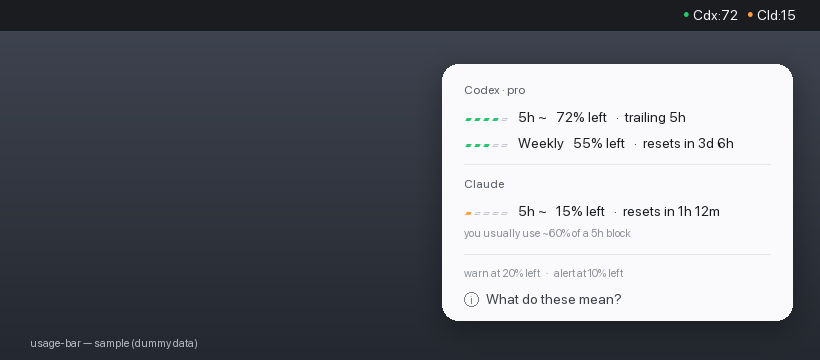

# usage-bar

A tiny macOS **menu-bar indicator for your Codex and Claude usage limits** — so you can glance up and see how much you have left instead of hunting through each tool. It reads your own local usage files, colors green → orange → red as you approach a limit, and pops a notification before you hit the wall.

```
● Cdx:100   ● Cld:89        ← always visible: % LEFT, one tinted dot per tool
──────────────
Codex · prolite
  ▰▰▰▰▰  5h ~     100% left   ·  trailing 5h
  ▰▰▰▱▱  Weekly    63% left   ·  resets in 76h
Claude
  ▰▰▰▰▱  5h ~      89% left   ·  resets in 4h
  you usually use ~56% of a 5h block
──────────────
warn at 20% left   ·   alert at 10% left
```

The menu bar shows a small status dot per tool (green → amber → red) with the % left; the dropdown breaks each tool into its windows with a 5-cell meter.



## What it shows, and how much to trust each number

Everything is read **locally**; nothing is sent anywhere. Numbers are shown as **% left** (like a battery — high/green is good).

| Window | Source | Accuracy |
|---|---|---|
| **Codex Weekly** | exact, straight from Codex's own `rate_limits` | 💯 exact |
| **Codex 5h** `~` | reconstructed from your rollout token logs (Codex stopped reporting a 5h window) | estimate |
| **Claude 5h** `~` | `ccusage`: current 5h block vs your peak block | estimate |

`~` marks an estimate. The two estimates are **display-only** — only the enforced limits (Codex windows + Claude 5h) ever send a notification, so you don't get false alarms. Warning fires at 20% left, critical at 10% left.

## Requirements

- **macOS** with **Xcode Command Line Tools** (`xcode-select --install`) for `swiftc`.
- **[Codex CLI](https://developers.openai.com/codex/cli)** — recent enough that it writes `rate_limits` into its session logs (older versions show blank Codex numbers).
- **[Claude Code](https://www.anthropic.com/claude-code)** + **[ccusage](https://github.com/ryoppippi/ccusage)** (`npm i -g ccusage`) for the Claude number. Optional — Codex works without it.

It uses whatever Codex/Claude you already have installed. No accounts or config to set up.

## Install

```sh
git clone https://github.com/<you>/ai-usage-bar.git
cd ai-usage-bar
./install.sh
```

The installer detects `ccusage`/`node`, compiles the app to `~/.local/bin/usage-bar`, installs a LaunchAgent (so it runs at login and restarts itself), and starts it. Look top-right for `🟢 Cdx:… Cld:…`. The first notification may ask for permission.

> **Note on the notch:** the title is compact so it survives a crowded menu bar, but if you have a lot of menu-bar apps you may want a manager like [Ice](https://github.com/jordanbaird/Ice) to pin it.

## Uninstall

```sh
./uninstall.sh
```

Removes the app, LaunchAgent, and state. Leaves `ccusage` in place.

## Configuration

Thresholds live at the top of `src/usage_brain.py`:

```python
WARN  = 80   # % used -> orange + first notification (20% left)
ALERT = 90   # % used -> red + louder notification  (10% left)
```

Edit, then re-run `./install.sh` (or copy the file to `~/.local/share/usage-bar/` and `launchctl kickstart -k gui/$(id -u)/com.usage-bar.agent`).

## How it works

A ~60-line Swift shell (`NSStatusItem`, no Dock icon) runs a Python "brain" every 60s and renders its output. The brain:

- reads Codex's newest `~/.codex/sessions/**/rollout-*.jsonl` for the exact weekly `rate_limits`, and reconstructs a trailing-5h estimate from per-turn token deltas;
- shells out to `ccusage` for the Claude 5h block;
- fires notifications via `osascript` only when an enforced limit crosses a threshold (once per crossing).

## Limitations

- The 5h numbers are **estimates**, calibrated against your own busiest 5h — a "how close am I, roughly" signal, not an official percentage.
- Depends on Codex/Claude local file formats; a future change to either could require an update.
- Because notifications fire through `osascript`, the banner's sender label reads as *Script Editor* rather than *usage-bar* (avoiding that needs a signed `.app` bundle).

## License

MIT — see [LICENSE](LICENSE).
